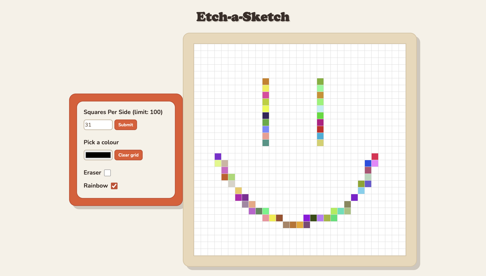

# Etch-a-Sketch
A browser version of the classic Etch-a-Sketch toy that I made while going through The Odin Project's Foundation course. Users choose the grid size (between 1 and 100, inclusive), can choose the pen colour via the colour picker, or the rainbow pen mode, and there is also an eraser. There is also the option to clear the grid, which preserves the user's chosen grid size but creates a blank slate.

Try it out here: 

## How It's Made
**Tech used:** HTML, CSS, JavaScript

The UI was created with vanilla HTML and CSS (I used a tiny bit of webkit to style the inputs), utilising flexbox to position the elements. The logic and DOM manipulation were written in vanilla JavaScript.

## Lessons Learned
CSS gets weird and difficult when you want to iron out small, specific details. For example, I initially wanted to turn the rainbow pen and eraser checkboxes into toggle switches but a lot of logic is needed to make something that looks so simple. I did not have the brainpower to implement that, but it's something I will probably tackle in the future.